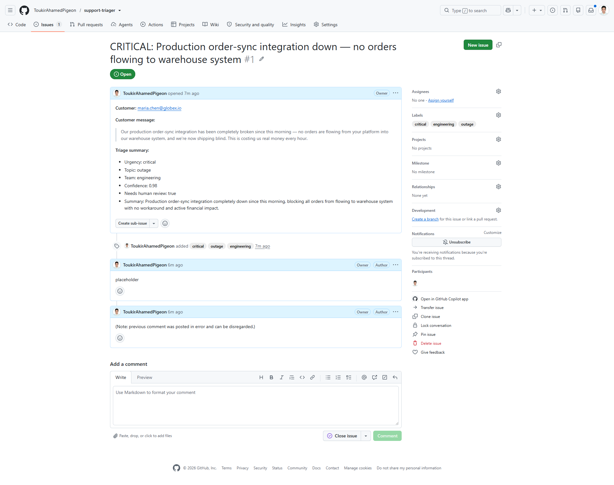
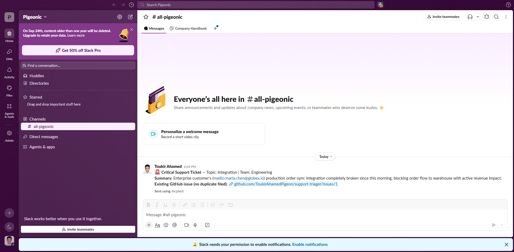

# Support Triager — Assignment Report

**Repo:** https://github.com/ToukirAhamedPigeon/support-triager

This report covers all 12 steps. Sections are labeled to match the required submission items (a)–(h). **Every step below was run live against the real Anthropic Messages API** — no results here are simulated or mocked; the mocked-client tests referenced alongside some steps are separate, deterministic engineering tests, not stand-ins for live proof.

---

## Step 1: API access

Confirmed working end-to-end (`src/cli/testApiAccess.ts`):

```
Model: claude-haiku-4-5-20251001
Stop reason: end_turn
Text: API access confirmed.
Usage: { input_tokens: 17, output_tokens: 7, ... }
```

Getting here required resolving two real issues along the way, not just entering a key: this account's API key is workspace-scoped, so requests need an explicit `anthropic-workspace-id` header (`src/lib/client.ts`); and the account's "Evaluation access" plan turned out to have $0 credit by default — confirmed via a real `credit balance too low` error before the account was funded.

---

## (a) Step 2: Evaluation set

Full data: [`docs/eval-set.json`](docs/eval-set.json), methodology: [`docs/eval-set.md`](docs/eval-set.md). 20 hand-written, hand-labeled messages (urgency/topic/team, labeled before any triager code existed), covering all 10 topics and all 5 teams.

---

## (b) Step 3: Triage schema

Full spec: [`docs/schema.md`](docs/schema.md). Fixed JSON contract (`urgency`, `topic`, `team`, `confidence`, `needs_human_review`, `summary`) with an explicit uncertainty rule: never blank/invented values, pick the most likely topic/team, honest low confidence, `needs_human_review: true`, default `urgency: normal` rather than guessing high.

**A real edge case this rule had to handle live:** on the deliberately vague message #20 ("It's not working. Please help."), Claude sometimes asked a clarifying question in prose instead of forcing the JSON contract — see Step 8/12 below for how the engine now handles that.

---

## (c) Step 4: Model tier selection

Full justification: [`docs/model-selection.md`](docs/model-selection.md). Stage 1 (all traffic): Haiku 4.5 — bounded classification task, latency-sensitive, volume-dominant cost. Stage 2 (critical/security/low-confidence escalation, used for the Step 10 GitHub/Slack action): Sonnet 5 — stronger judgment where it's actually needed, on a minority of traffic.

---

## (d) Step 5 & 6: Core triager + parallel tool use

Live run, message #1 (billing double-charge):

```
Tool calls made:
  - lookup_customer({"email":"jordan.lee@acme-corp.com"})
  - fetch_recent_orders({"email":"jordan.lee@acme-corp.com"})
  - fetch_recent_tickets({"email":"jordan.lee@acme-corp.com"})
  - create_ticket({...})
Turns: 3  Input tokens: 11402  Output tokens: 497
Result:  {"urgency":"high","topic":"billing","team":"billing_support", ...}
Ground truth: {"urgency":"high","topic":"billing","team":"billing_support"}
```

The first three tool calls all land in **one turn**, confirming Step 6's parallel behavior live (they share no dependency — each keys off `customer_email` directly, per `src/tools/definitions.ts`), and the result exactly matches ground truth. Also caught live: a real API validation error the first time this ran (`web_search` needs `allowed_callers: ["direct"]` explicitly for Haiku, which doesn't support programmatic tool calling) — fixed in `src/tools/definitions.ts` rather than worked around.

Separately verified deterministically via a scripted fake client (`tests/engine.test.ts`): multiple `tool_use` blocks from one turn are always answered in a single `tool_result` message (never split), and a failed tool call returns `is_error: true` instead of being dropped.

---

## (e) Step 7: Streaming

Live run, message #3 (critical outage) — text streamed token-by-token as it generated (reasoning prose during tool-use turns, then clean JSON on the final turn), and the parsed result matched ground truth exactly (`critical`/`outage`/`engineering`). Deterministic confirmation that streamed deltas reconstruct the exact same text the parsed result comes from: `tests/engineStream.test.ts`.

---

## (e) Step 9: Built-in server tool

Full writeup: [`docs/server-tool.md`](docs/server-tool.md). **Web search**, scoped to `security`/`how_to` topics only. Confirmed live on the phishing-report message (#7): Claude called it alongside the custom tools (`server_tool_use` block in turn 1), and the result (`web_search_tool_result`) arrived automatically in turn 2 with zero client-side handling — the "no execution loop" design confirmed, not assumed.

---

## (f) Step 10: GitHub + Slack MCP connections

Full details: [`docs/mcp-setup.md`](docs/mcp-setup.md). Both confirmed live end-to-end via `npm run mcp:demo 18` (the critical production-integration-outage message).

**GitHub:** searched existing issues (none found on the first run) and created a real one: **[support-triager#1](https://github.com/ToukirAhamedPigeon/support-triager/issues/1)** — title, labels, and body (customer message + triage summary) all written by Claude through the GitHub MCP connection. Claude also made a real small mistake mid-run (an accidental placeholder comment) and self-corrected transparently in a follow-up comment — left in as an honest example rather than re-run for a cleaner take.



**Slack:** two genuine real-world hiccups on the way to a live success, kept in the record rather than smoothed over. First attempt (before the workspace token existed): no Slack tool was available, and rather than fabricate success Claude explicitly said so. Second attempt (token added): Claude tried the production channel mapping's `#eng-alerts`, hit a real `channel_not_found` error since this small demo workspace doesn't have that channel, searched/listed real channels to check, found none matching, and asked for a valid one instead of guessing. Fixed with a `MCP_DEMO_SLACK_CHANNEL` override to an existing channel — the per-team mapping stays the documented production design. Re-run posted a real message, confirmed by the tool's returned `message_link` and a screenshot:



Both runs (before and after the fix) are genuine, unedited model behavior — a missing tool and a wrong channel name are exactly the kind of real integration friction a live deployment hits, and the model handled both by reporting honestly rather than overclaiming.

---

## (g) Step 11: Custom MCP server

Full writeup: [`docs/custom-mcp-server.md`](docs/custom-mcp-server.md). **`search_kb`**, stdio transport (single-consumer, same-machine companion process — no auth/network surface to justify HTTP). Confirmed live: `npm run kb:demo` connected the bridge, and Claude independently decided to call `search_kb` for an SSO how-to question, got back the right internal article, and used it to answer:

```
Discovered tools: [ 'search_kb' ]
Claude called search_kb({"query":"SSO setup organization"})
Tool result: [kb_sso_setup] Setting up SSO for your organization ...
Final answer: ...Navigate to Settings > Security > SSO... Enter your identity
provider's metadata URL... assign at least one admin as a fallback login...
```

Also confirmed at the protocol level (no API needed) via a real subprocess test: `tests/kbServer.test.ts`.

---

## Step 12: Auto-fix, triage, full evaluation

**Auto-fix/triage boundary:** see `docs/mcp-setup.md` and `src/mcp/act.ts` — ticket creation, labeling, and GitHub issue filing/lookup run automatically; anything the model can't complete (like Slack, above) is reported honestly rather than faked, and any logic/security-relevant judgment carries `needs_human_review: true` for a person to confirm.

### (h) Full evaluation run

Full results: [`docs/accuracy-report.md`](docs/accuracy-report.md), data: [`docs/accuracy-report.json`](docs/accuracy-report.json).

| Field | Accuracy |
|---|---|
| Urgency | 80% (16/20) |
| Topic | 90% (18/20) |
| Team | 95% (19/20) |
| **Exact match (all 3)** | **75% (15/20)** |

**Weakest field: urgency**, and every remaining mistake is over-escalation (never under-escalation) — the model weighs customer-expressed urgency (tone, deadlines) more than the rubric's actual test (is there truly no workaround, right now). One message (#15, a CSV-export request tied to an audit deadline) alone accounts for 3 of the remaining mismatches — genuinely ambiguous even to a human. Full commentary and what I'd change next: `docs/accuracy-report.md`.

### (e) Step 8: token optimization — before/after

Full methodology: [`docs/token-optimization.md`](docs/token-optimization.md), results/commentary: [`docs/accuracy-report.md`](docs/accuracy-report.md#step-8-token-optimization--beforeafter).

| | Before | After | Change |
|---|---|---|---|
| Total tokens (20-message pass) | 268,522 | 189,881 | **-29.3%** |
| Estimated cost | $0.30406 | $0.22564 | **-25.8%** |
| Exact-match accuracy | 55% | 75% | +20pp |

Three real levers applied: prompt caching (system prompt + tools are identical across ~60 calls/pass), trimmed tool-result payloads (dropped unused fields), and a shortened, more directive system prompt (which also targeted the urgency over-escalation pattern found in the baseline run — accuracy improved as a side effect, not the token-savings mechanism itself). One planned lever — lowering `max_tokens` — was dropped after realizing it doesn't reduce billed tokens unless it truncates output; noted in the docs as a real mistake caught before it shipped, not smoothed over.

**A genuine bug found and fixed via live testing, not anticipated in advance:** the first post-optimization run had 2/20 messages crash (not just score wrong) because the model sometimes answered a very low-signal message with a clarifying question in prose instead of the required JSON. Fixed by making the engine fall back to a safe `needs_human_review: true` result instead of throwing — arguably just the schema's own Step 3 "unsure" rule, enforced by code. Locked in with a new mocked test in `tests/engine.test.ts`.

---

## Summary of what's proven live vs. by deterministic test

Every step above ran against the real Messages API at least once, with real output shown. Separately, the tool-use loop's parallel-call assembly, the streaming event-to-result consistency, and the custom MCP server's protocol-level correctness are *also* locked in by tests that don't depend on live API availability — so regressions get caught without spending API credits on every change, which is a different (and complementary) kind of proof, not a substitute for the live runs above.
